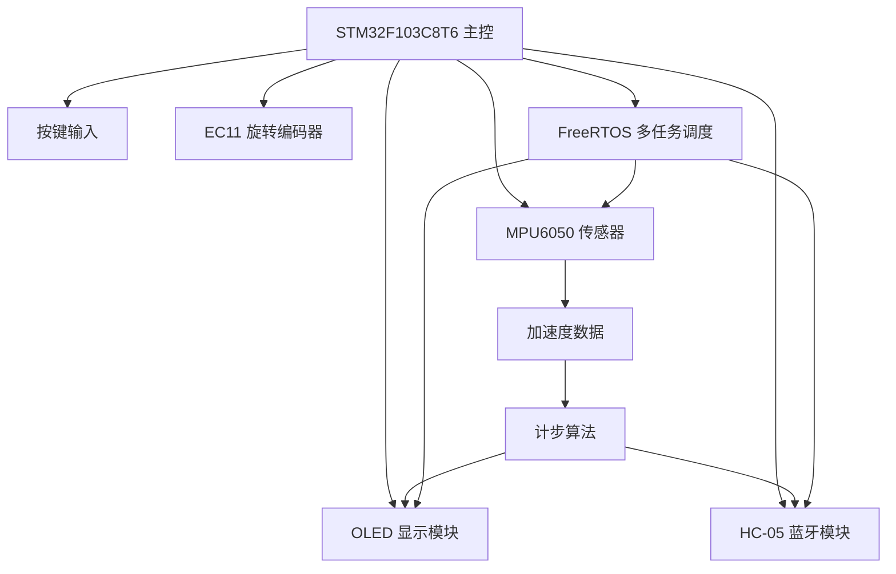
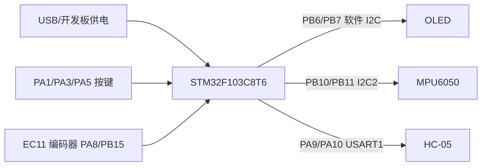
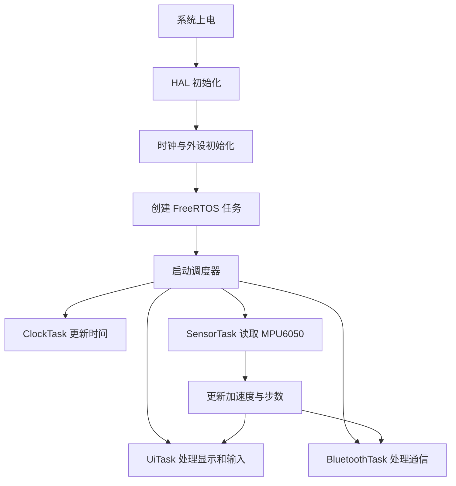
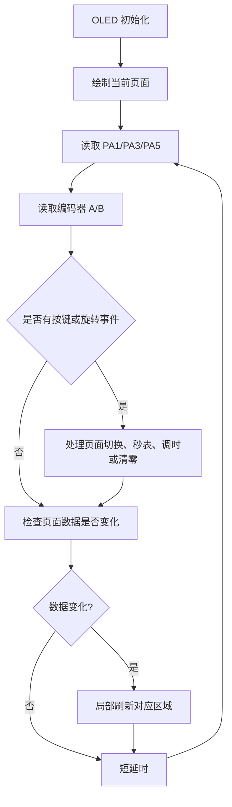

# 基于 STM32F103C8T6 的智能手表系统设计文档

> 课程设计题目 2：基于 STM32F103C8T6 的智能手表设计  
> 当前文档版本：2026-07-01  
> 工程名称：SmartWatch_HAL_RTOS  
> 开发环境：STM32CubeIDE + HAL 库 + FreeRTOS CMSIS_V1  

## 1. 项目概述

本项目设计并实现一套基于 STM32F103C8T6 的智能手表原型系统。系统以 STM32F103C8T6 为主控制器，使用 FreeRTOS 进行多任务管理，通过 OLED 屏显示时间、秒表、传感器数据和运动步数，通过按键与旋转编码器完成页面切换和参数调整，通过 MPU6050 获取加速度数据并实现简易计步功能，通过 HC-05 蓝牙模块与手机串口助手进行数据同步。

本项目采用面包板完成硬件搭建和现场展示，不进行 PCB 制作。根据课程题目要求，项目重点放在基本功能和可展示扩展功能上：完成 OLED 多页面显示、FreeRTOS 多任务调度、MPU6050 数据读取、运动计步、旋转编码器菜单控制和蓝牙通信。该路线能够覆盖基本要求，并以“计步功能”替代 PCB 作为冲击优秀等级的扩展项。

## 2. 设计目标

### 2.1 基本目标

1. 完成 STM32F103C8T6、OLED、MPU6050、按键、旋转编码器、HC-05 蓝牙模块的硬件连接与调试。
2. 基于 STM32CubeIDE 和 HAL 库建立可编译、可烧录的工程。
3. 启用 FreeRTOS，实现时间管理、界面显示、传感器读取、蓝牙通信等任务分工。
4. 在 OLED 上实现多页面显示，至少包含时间页面和传感器数据页面。
5. 实现稳定的人机交互，支持按键和旋转编码器切换页面、调整时间、控制秒表。

### 2.2 扩展目标

1. 增加旋转编码器，实现多页面菜单切换和时钟调节辅助操作。
2. 增加 HC-05 蓝牙模块，实现与手机串口助手的数据同步。
3. 基于 MPU6050 加速度数据实现简易运动计步，并在 OLED 和蓝牙端显示步数。
4. 优化 OLED 刷新方式，避免整屏频繁清屏导致的闪烁。

## 3. 物料到位情况

| 物料名称 | 型号/规格 | 数量 | 当前状态 | 用途 |
| --- | --- | ---: | --- | --- |
| STM32 开发板 | STM32F103C8T6 | 1 | 已到位 | 主控与程序运行平台 |
| OLED 显示屏 | SSD1306 I2C OLED | 1 | 已到位 | 显示页面、时间、传感器和步数 |
| 面包板 | 常规实验面包板 | 1 | 已到位 | 硬件连接和展示 |
| 杜邦线 | 公对公/公对母 | 若干 | 已到位 | 模块连接 |
| 独立按键 | 普通轻触按键 | 3 | 已到位 | 页面切换、确认、增加/清零 |
| 旋转编码器 | EC11，带按压开关 | 1 | 已到位 | 菜单切换与参数选择 |
| MPU6050 模块 | GY-521/MPU6050 | 1 | 已到位 | 加速度采集与计步 |
| HC-05 蓝牙模块 | 串口蓝牙模块 | 1 | 已到位 | 手机端数据同步 |
| USB 数据线/下载线 | Type-C/USB | 1 | 已到位 | 供电、烧录、调试 |

说明：本阶段不制作 PCB，不进行手表外壳封装。电池供电和蜂鸣器属于可选展示内容，不作为当前系统主线。

## 4. 系统总体方案

系统由主控模块、显示模块、输入模块、传感器模块和蓝牙通信模块组成。STM32F103C8T6 作为核心控制器，负责运行 FreeRTOS、管理各外设、处理按键和编码器输入、刷新 OLED 页面、读取 MPU6050 数据、计算步数并通过 HC-05 上报数据。



系统软件采用多任务结构，而不是传统单一 `while(1)` 轮询结构。时间累加、传感器读取、界面刷新和蓝牙通信分别放在不同任务中执行。这样做的好处是功能边界清晰，某个模块出现短时间等待时，不会直接阻塞全部功能。

## 5. 硬件设计


### 5.1 主控模块

主控芯片采用 STM32F103C8T6，内核为 ARM Cortex-M3，满足本项目对 GPIO、I2C、USART 和 FreeRTOS 运行的需求。工程使用 HAL 库进行外设初始化，降低底层寄存器配置复杂度。

主控主要承担以下工作：

1. 运行 FreeRTOS 任务。
2. 通过 GPIO 读取按键和旋转编码器。
3. 通过软件 I2C 驱动 OLED。
4. 通过 I2C2 读取 MPU6050。
5. 通过 USART1 与 HC-05 蓝牙模块通信。

### 5.2 OLED 显示模块

OLED 采用 SSD1306 控制器，地址为 `0x78`。当前驱动使用 PB6/PB7 模拟 I2C，而不是依赖硬件 I2C1 发送。这样做便于在调试阶段直接控制时序，并且已经验证显示稳定。

| OLED 引脚 | STM32 引脚 | 说明 |
| --- | --- | --- |
| VCC | 3.3V/5V | OLED 供电，根据模块标注选择 |
| GND | GND | 共地 |
| SCL | PB6 | 软件 I2C 时钟 |
| SDA | PB7 | 软件 I2C 数据 |

OLED 已实现普通字符显示、数字显示和 2 倍大字体显示。时钟页和秒表页使用大字体，提高现场展示可读性。

### 5.3 MPU6050 传感器模块

MPU6050 通过硬件 I2C2 接入 STM32，地址为 `0x68`。系统初始化时读取 `WHO_AM_I` 判断模块是否在线，若识别成功，则周期读取加速度和陀螺仪原始数据。

| MPU6050 引脚 | STM32 引脚 | 说明 |
| --- | --- | --- |
| VCC | 3.3V/5V | 根据模块稳压情况接入 |
| GND | GND | 共地 |
| SCL | PB10 | I2C2_SCL |
| SDA | PB11 | I2C2_SDA |

MPU6050 页面显示 AX、AY、AZ 三轴加速度原始值。计步页面显示累计步数、运动强度值和当前触发状态。

### 5.4 按键与旋转编码器

按键采用 GPIO 输入上拉，按下时为低电平。旋转编码器 A/B 两相分别接入 GPIO，公共端 C 接 GND。程序通过轮询 A/B 状态变化判断旋转方向。

| 功能 | STM32 引脚 | 说明 |
| --- | --- | --- |
| 下一页/字段切换 | PA1 | 普通按键，低电平有效 |
| 增加/清零 | PA3 | 普通按键，低电平有效 |
| 确认/启动暂停 | PA5 | 普通按键，低电平有效 |
| 编码器 A 相 | PA8 | EC11 A 相 |
| 编码器 B 相 | PB15 | EC11 B 相 |
| 编码器 C 端 | GND | 公共端接地 |

当前交互方式：

| 页面 | PA1 | PA3 | PA5 | 编码器 |
| --- | --- | --- | --- | --- |
| 主页面 | 下一页 | 无特殊功能 | 无特殊功能 | 切换页面 |
| 秒表页 | 下一页 | 清零 | 启动/暂停 | 切换页面 |
| 时钟页 | 下一页；调时模式下切换时/分/秒 | 调时模式下增加选中项 | 进入/退出调时 | 切换页面；调时模式下辅助调节 |
| MPU6050 页 | 下一页 | 无特殊功能 | 无特殊功能 | 切换页面 |
| 计步页 | 下一页 | 清零步数 | 无特殊功能 | 切换页面 |

### 5.5 蓝牙通信模块

HC-05 使用 USART1 与 STM32 通信，波特率设置为 9600，数据格式为 8 位数据位、1 位停止位、无校验。

| HC-05 引脚 | STM32 引脚 | 说明 |
| --- | --- | --- |
| VCC | 5V/3.3V | 按模块底板标注接入 |
| GND | GND | 共地 |
| TXD | PA10 | STM32 USART1_RX |
| RXD | PA9 | STM32 USART1_TX |

蓝牙协议采用简单 ASCII 文本，方便使用手机串口助手展示：

| 手机发送 | STM32 响应 | 功能 |
| --- | --- | --- |
| `S` 或 `s` | 返回步数、时间、AX/AY/AZ | 查询完整状态 |
| `C` 或 `c` | `OK,CLEAR` | 清零步数 |
| 步数增加 | 自动发送 `Steps: n` | 步数同步 |

### 5.6 硬件连接框图



### 5.7 关键电气参数

| 项目 | 参数 | 说明 |
| --- | --- | --- |
| 主控工作电压 | 3.3V | STM32F103C8T6 IO 电平以 3.3V 为基准 |
| OLED 通信地址 | 0x78 | SSD1306 常见 8 位地址 |
| MPU6050 7 位地址 | 0x68 | `WHO_AM_I` 正常时可识别模块 |
| I2C2 速率 | 100 kHz | 传感器读取稳定优先 |
| USART1 波特率 | 9600 bps | 匹配 HC-05 普通通信默认波特率 |
| 按键/编码器输入 | 上拉，低电平有效 | 公共端接 GND，按下或导通时读取为低 |
| FreeRTOS 堆大小 | 4096 bytes | 适配当前多个任务 |
| OLED 刷新方式 | 页面切换清屏，数值变化局部刷新 | 降低闪烁 |

### 5.8 PCB 与封装规划

本项目当前不制作 PCB，采用面包板完成连接、调试和展示。原因是课程周期较短，单人完成时应优先保证核心功能、传感器、蓝牙和计步功能稳定。若后续继续完善，可将 STM32 最小系统、OLED 接口、MPU6050 接口、HC-05 接口、按键/编码器接口集中到一块扩展板上，布局时应注意：

1. 电源线和地线尽量加粗，OLED、MPU6050、HC-05 附近预留去耦电容。
2. I2C 线保持短且并行走线距离不要过长，必要时增加 4.7k 上拉电阻。
3. HC-05 天线区域避免被铜皮和排线遮挡。
4. 按键和编码器靠近板边，便于操作。
5. 下载接口和串口调试接口保留在易插拔位置。

## 6. STM32CubeMX 外设配置

| 外设/功能 | 配置内容 |
| --- | --- |
| SYS Debug | Serial Wire |
| HAL Timebase | TIM2 |
| FreeRTOS | Enabled，CMSIS_V1 |
| I2C1 | PB6=SCL，PB7=SDA，100 kHz；当前 OLED 实际使用软件 I2C |
| I2C2 | PB10=SCL，PB11=SDA，100 kHz；连接 MPU6050 |
| USART1 | PA9=TX，PA10=RX，9600 bps |
| GPIO 输入 | PA1、PA3、PA5、PA8、PB15，上拉输入，低电平有效 |

## 7. 软件设计

### 7.1 软件结构

工程基于 STM32CubeIDE 生成，核心代码位于：

| 文件 | 作用 |
| --- | --- |
| `Core/Src/freertos.c` | FreeRTOS 任务、界面逻辑、按键编码器处理、计步和蓝牙逻辑 |
| `Core/Src/oled.c` | SSD1306 OLED 软件 I2C 驱动 |
| `Core/Inc/oled.h` | OLED 驱动接口 |
| `Core/Src/mpu6050.c` | MPU6050 初始化与数据读取 |
| `Core/Inc/mpu6050.h` | MPU6050 数据结构与接口 |
| `Core/Src/i2c.c` | I2C1/I2C2 初始化 |
| `Core/Src/usart.c` | USART1 初始化 |
| `Core/Src/gpio.c` | GPIO 初始化 |

### 7.2 FreeRTOS 任务划分

| 任务名称 | 优先级 | 栈大小 | 周期/触发 | 主要功能 |
| --- | --- | ---: | --- | --- |
| defaultTask | Normal | 128 | 1 ms 空循环 | 保留 CubeMX 默认任务 |
| clockTask | Normal | 128 | 1 s | 维护运行时间、秒表时间和软件时钟 |
| sensorTask | Normal | 128 | 200 ms | 初始化 MPU6050，读取传感器数据，更新计步 |
| bluetoothTask | BelowNormal | 128 | 100 ms 轮询 | 接收手机指令，步数变化时自动上报 |
| uiTask | AboveNormal | 256 | 10 ms 轮询 | OLED 初始化、页面显示、按键和编码器输入处理 |

任务设计原则：

1. UI 任务优先级较高，保证按键响应和页面刷新流畅。
2. 传感器任务周期读取 MPU6050，避免在 UI 任务中直接等待 I2C。
3. 蓝牙任务优先级较低，避免串口发送影响显示和传感器采集。
4. 时间任务只做计数，不做复杂显示，减少任务耦合。

### 7.3 界面页面设计

OLED 当前共有 5 个页面：

| 页面编号 | 页面名称 | 显示内容 |
| ---: | --- | --- |
| 0 | 主页面 | `Smart Watch`、`FreeRTOS OK`、运行时间 |
| 1 | 秒表页面 | 大字体秒表时间、运行/暂停状态 |
| 2 | 时钟页面 | 大字体实时时间、正常/调时状态 |
| 3 | MPU6050 页面 | MPU6050 状态、AX/AY/AZ 数据 |
| 4 | 计步页面 | 步数、运动强度、Ready/Step Active |

OLED 刷新经过优化：页面切换时才清屏，页面内数值变化时只刷新对应区域。这样可以避免整屏每秒清空重画造成的明显闪烁。

### 7.4 主程序流程



### 7.5 UI 任务流程



## 8. 关键算法设计

### 8.1 软件时钟与秒表

系统未使用外部 RTC 芯片，时钟由 FreeRTOS 时间任务每秒累加。`clockTask` 每 1 秒执行一次：

1. `g_uptime_seconds` 增加，用于主页面显示系统运行时间。
2. 若秒表处于运行状态，`g_stopwatch_seconds` 增加。
3. `g_clock_seconds` 增加，并对 24 小时取模。

时钟页支持手动调时，调时模式下可分别调整小时、分钟、秒。

### 8.2 旋转编码器方向判断

EC11 编码器输出 A/B 两相信号。程序读取 A/B 当前状态，与上一次状态组合成状态转移索引，通过查表得到旋转方向。为减小抖动影响，程序使用累加方式判断有效步进，达到设定阈值后才认为发生一次旋转。

### 8.3 MPU6050 计步算法

计步算法使用三轴加速度原始数据计算运动强度：

```text
motion = ax^2 + ay^2 + az^2
```

当运动强度高于高阈值，并且当前不处于冷却状态时，判定为一次步伐触发，步数加 1。随后进入短暂冷却，避免一次摆动被重复计数。当运动强度低于低阈值时，允许下一次触发。

当前阈值：

| 参数 | 当前值 | 说明 |
| --- | ---: | --- |
| 高阈值 | 420000000 | 超过该值判定为步伐触发 |
| 低阈值 | 330000000 | 低于该值解除步伐触发状态 |
| 冷却采样数 | 1 | 控制连续触发间隔 |
| 采样周期 | 200 ms | MPU6050 读取周期 |

该算法属于课程设计展示用的简易计步算法，重点是能展示加速度变化和步数同步。实际商用计步还需要滤波、姿态补偿和更复杂的误触发抑制。

### 8.4 蓝牙通信策略

蓝牙通信使用简单文本协议。为了避免蓝牙发送占用过多任务栈，程序不使用 `printf/snprintf` 进行格式化输出，而是使用轻量字符串拼接函数发送数字和文本。

蓝牙任务的行为：

1. 周期轮询 USART1 是否收到手机指令。
2. 收到 `S` 时发送完整状态。
3. 收到 `C` 时清零步数。
4. 检测到步数增加时自动发送当前步数。

手机端偶尔把 `Steps: n` 分成两行显示，是因为 HC-05 传输的是串口字节流，手机 App 按接收分包显示，不影响实际数据内容。

## 9. 当前完成情况

### 9.1 已完成内容

| 模块 | 完成情况 |
| --- | --- |
| STM32CubeIDE 工程 | 已建立，能编译通过 |
| FreeRTOS | 已启用 CMSIS_V1，任务已划分 |
| OLED 显示 | 已完成驱动和多页面显示 |
| OLED 刷新优化 | 已从整屏刷新改为局部刷新，闪烁明显降低 |
| 秒表功能 | 已完成启动、暂停、清零 |
| 软件时钟 | 已完成显示和手动调时 |
| 按键输入 | 已完成 PA1/PA3/PA5 输入 |
| 旋转编码器 | 已完成 A/B 相读取和页面切换 |
| MPU6050 | 已完成 I2C2 读取，AX/AY/AZ 可显示 |
| 计步功能 | 已完成简易计步和 OLED 显示 |
| HC-05 蓝牙 | 已完成手机连接、状态查询、清零和步数自动上报 |

### 9.2 编译结果

当前 Debug 构建已通过，最近一次编译结果如下：

```text
text: 27956
data: 24
bss: 6976
```

说明程序已经能在 STM32F103C8T6 工程中通过链接，资源占用仍处于可接受范围。FreeRTOS 堆大小已调整为 4096，以适配当前多任务数量。

### 9.3 进度汇报

| 阶段 | 当前情况 | 说明 |
| --- | --- | --- |
| 选题与方案 | 已完成 | 确定题目 2，采用 STM32F103C8T6 + OLED + FreeRTOS 路线 |
| 物料采购 | 已完成主要物料 | STM32、OLED、按键、编码器、MPU6050、HC-05 已用于调试 |
| 基础工程 | 已完成 | STM32CubeIDE 工程可编译、可烧录 |
| OLED 显示 | 已完成 | 多页面显示和局部刷新已调通 |
| 输入交互 | 已完成 | 按键和旋转编码器可用 |
| MPU6050 | 已完成 | 三轴数据可显示 |
| 计步功能 | 已完成基础版本 | 可根据运动触发步数增加 |
| 蓝牙通信 | 已完成基础版本 | 手机可查询状态、清零步数，步数增加可自动上报 |
| 文档整理 | 进行中 | 当前完成系统设计文档，后续补充中期报告和测试截图 |
| 验收准备 | 待完善 | 需要固定接线、录制演示视频、整理答辩说明 |

## 10. 测试方案

| 测试项目 | 测试方法 | 预期结果 | 当前状态 |
| --- | --- | --- | --- |
| OLED 上电显示 | 烧录程序后观察 OLED | 显示主页面 `Smart Watch` | 已通过 |
| 页面切换 | 按 PA1 或旋转编码器 | 5 个页面循环切换 | 已通过 |
| 秒表功能 | 进入秒表页，按 PA5/PA3 | PA5 启停，PA3 清零 | 已通过 |
| 时钟调节 | 进入时钟页，按 PA5 进入调时 | 可调整小时、分钟、秒 | 已通过 |
| MPU6050 通信 | 进入 MPU6050 页面 | 显示 `MPU6050 OK` 和三轴数据 | 已通过 |
| 计步功能 | 摇动或携带模块运动 | 步数增加，Ready/Active 状态变化 | 已通过 |
| 蓝牙连接 | 手机连接 HC-05 | 手机能收到数据 | 已通过 |
| 蓝牙查询 | 手机发送 `S` | 返回步数、时间、传感器数据 | 已通过 |
| 蓝牙清零 | 手机发送 `C` | 返回 `OK,CLEAR`，步数清零 | 已通过 |
| 蓝牙自动上报 | 步数增加 | 自动发送 `Steps: n` | 已通过 |

## 11. 存在问题与改进方向

1. 计步算法目前为阈值法，能展示步数变化，但准确度仍受手持姿态和动作幅度影响。后续可加入滑动平均滤波和动态阈值。
2. HC-05 蓝牙传输为串口字节流，手机端显示可能将一条消息拆成多行。数据本身不丢失，若后续需要更美观的显示，可开发手机端上位机或改用更短协议。
3. 当前系统使用面包板连接，便于调试但抗干扰和牢固程度不如 PCB。验收前需要固定关键连接线，避免现场接触不良。
4. 当前未实现电池供电和低功耗管理。若后续继续完善，可加入锂电池、充电保护、电源开关和睡眠模式。
5. 当前 OLED 字库较简化，主要用于英文和数字显示。若需要中文菜单，需要扩展字库或改用图形化字模。

## 12. 后续工作计划

| 时间 | 工作内容 | 目标 |
| --- | --- | --- |
| 7 月 2 日前 | 整理设计文档、确认演示流程 | 完成设计文档提交 |
| 7 月 3 日至 7 月 5 日 | 稳定硬件接线，补充测试记录和照片 | 为中期检查准备证据 |
| 7 月 6 日前 | 准备中期检查说明 | 展示当前完成度和后续计划 |
| 7 月 7 日至验收前 | 优化计步阈值、整理答辩话术 | 提高展示稳定性 |
| 验收前 | 录制功能演示视频，备份代码和文档 | 降低现场故障风险 |

## 13. 结论

本项目已经形成一套可运行、可展示、可答辩的 STM32 智能手表原型系统。系统完成了课程题目中的核心要求：基于 STM32F103C8T6 完成硬件连接，基于 FreeRTOS 实现多任务管理，完成 OLED 时间显示和传感器数据读取。同时，项目进一步实现了旋转编码器菜单控制、HC-05 蓝牙数据同步和基于 MPU6050 的简易计步功能。

虽然本项目不制作 PCB，但通过计步功能补足扩展要求，并且当前功能覆盖度较高，适合在有限时间内完成中期检查和最终验收。后续重点应放在接线稳定性、演示流程、测试记录和答辩表达上，而不是继续盲目增加新模块。
